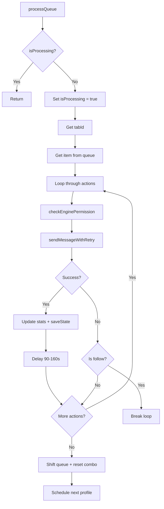
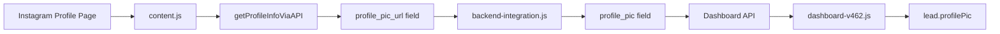

# Critical Fixes Plan - E.I.O System

## Overview

This plan addresses two critical issues:

1. **Motor de Execução (Background.js)**: System is ignoring order and delays
2. **Interface do Dashboard (Frontend)**: Not showing real profile photos

---

## PART 1: Motor de Execução Fix - Background.js

### Problem Analysis

The current [`processQueue()`](extension/background.js:513) function has issues:

1. **Delay timing** - Need `randomDelay(min=90, max=160)` function in SECONDS
2. **Sequence not strictly sequential** - Loop-based approach allows race conditions
3. **Logging not detailed** - Need step-by-step logs

### Proposed Solution

#### 1. Create randomDelay Helper

```javascript
async function randomDelay(min = 90, max = 160) {
    const delaySeconds = Math.floor(Math.random() * (max - min + 1)) + min;
    const delayMs = delaySeconds * 1000;
    console.log(`[Motor] Aguardando ${delaySeconds}s...`);
    return new Promise(resolve => setTimeout(resolve, delayMs));
}
```

#### 2. Rewrite executeInteractionCombo Function

Create a NEW strictly sequential async function with EXPLICIT await order:

```javascript
async function executeInteractionCombo(tabId, username, options) {
    console.log(`[Motor] Iniciando combo para @${username}...`);
    
    // STEP 1: Follow
    console.log(`[Motor] Passo 1 - Seguir executando...`);
    const followResult = await followAction(tabId, username, options);
    if (!followResult.success) {
        console.log(`[Motor] Passo 1 - Seguir FALHOU. Abortando combo.`);
        return { success: false, step: 'follow', error: followResult.error };
    }
    console.log(`[Motor] Passo 1 - Seguir OK.`);
    
    await randomDelay();  // Delay AFTER follow
    
    // STEP 2: Like Post 1
    console.log(`[Motor] Passo 2 - Like 1 executando...`);
    const like1Result = await likePostAction(tabId, username, 1, options);
    console.log(`[Motor] Passo 2 - Like 1 ${like1Result.success ? 'OK' : 'FALHOU'}.`);
    
    await randomDelay();  // Delay AFTER like 1
    
    // STEP 3: Like Post 2
    console.log(`[Motor] Passo 3 - Like 2 executando...`);
    const like2Result = await likePostAction(tabId, username, 2, options);
    console.log(`[Motor] Passo 3 - Like 2 ${like2Result.success ? 'OK' : 'FALHOU'}.`);
    
    await randomDelay();  // Delay AFTER like 2
    
    // STEP 4: Comment
    console.log(`[Motor] Passo 4 - Comentário executando...`);
    const commentResult = await commentAction(tabId, username, options);
    console.log(`[Motor] Passo 4 - Comentário ${commentResult.success ? 'OK' : 'FALHOU'}.`);
    
    await randomDelay();  // Delay AFTER comment
    
    // STEP 5: Story
    console.log(`[Motor] Passo 5 - Story executando...`);
    const storyResult = await storyAction(tabId, username, options);
    console.log(`[Motor] Passo 5 - Story ${storyResult.success ? 'OK' : 'FALHOU'}.`);
    
    console.log(`[Motor] Combo finalizado para @${username}!`);
    return { success: true, results: { followResult, like1Result, like2Result, commentResult, storyResult } };
}
```

#### 3. Create Individual Action Functions

```javascript
async function followAction(tabId, username, options) {
    try {
        const result = await sendMessageWithRetry(tabId, {
            action: 'execute',
            payload: { type: 'follow', target: username, options }
        });
        return { success: result?.success || result?.meta?.success || false, error: result?.error };
    } catch (e) {
        return { success: false, error: e.message };
    }
}

async function likePostAction(tabId, username, postIndex, options) {
    try {
        const result = await sendMessageWithRetry(tabId, {
            action: 'execute',
            payload: { type: 'like_feed_2', target: username, postIndex, options }
        });
        return { success: result?.success || result?.meta?.success || false, error: result?.error };
    } catch (e) {
        return { success: false, error: e.message };
    }
}

async function commentAction(tabId, username, options) {
    try {
        const result = await sendMessageWithRetry(tabId, {
            action: 'execute',
            payload: { type: 'comment', target: username, comment: options?.commentMessage || "Top!" }
        });
        return { success: result?.success || result?.meta?.success || false, error: result?.error };
    } catch (e) {
        return { success: false, error: e.message };
    }
}

async function storyAction(tabId, username, options) {
    try {
        const result = await sendMessageWithRetry(tabId, {
            action: 'execute',
            payload: { type: 'story_interact', target: username, options }
        });
        return { success: result?.success || result?.meta?.success || false, error: result?.error };
    } catch (e) {
        return { success: false, error: e.message };
    }
}
```

### Files to Modify

| File | Changes |
|------|---------|
| `extension/background.js` | Add randomDelay, add action functions, rewrite processQueue |

---

## PART 2: Dashboard Profile Photos Fix

### Problem Analysis

1. **Content.js captures avatar** - Code at lines 810-811 and 922-923 extracts profile_pic_url
2. **Field name inconsistency** - Different parts use different names: profile_pic_url, avatar, profilePic, profile_pic

### Field Name Mapping

| Source | Field Name |
|--------|------------|
| Instagram API | profile_pic_url |
| content.js | avatar or profile_pic_url |
| backend-integration.js | profile_pic |
| Dashboard | lead.profilePic |

### Solution

#### 1. Update content.js - Ensure Avatar Capture

Current code at [`content.js:922-923`](extension/content.js:922):

```javascript
const avatarEl = document.querySelector('header img');
if (avatarEl && avatarEl.src) info.avatar = avatarEl.src;
```

This is already working. Enhancement: Ensure it is included in all lead data structures.

#### 2. Update dashboard-v462.js - Fix Field Mapping

Current code at [`dashboard-v462.js:2583`](frontend/dashboard-v462.js:2583):

```javascript
 5) {
    avatarHtml = `${initial}</div>'">`;
} else {
    avatarHtml = `<div class="eio-profile-img-fallback">${initial}</div>`;
}
```

### Files to Modify

| File | Changes |
|------|---------|
| `extension/content.js` | Ensure avatar URL is captured in all extraction functions |
| `extension/backend-integration.js` | Ensure profile_pic field is sent to API |
| `frontend/dashboard-v462.js` | Fix field mapping, add proper fallback |
| `frontend/dashboard.css` | Add CSS classes for profile images |

---

## Implementation Order

1. **PART 1 - Background.js**: Rewrite the motor for strict sequential execution
2. **PART 2 - Content.js**: Verify/enhance avatar capture
3. **PART 3 - Dashboard**: Fix rendering and add fallback

## Testing Checklist

- [ ] Verify logs show sequential execution
- [ ] Verify delays are random between 90-160 seconds
- [ ] Verify combo stops if follow fails
- [ ] Verify combo continues if like/comment/story fails
- [ ] Verify profile photos appear in dashboard
- [ ] Verify fallback shows initial letter when no photo available
- [ ] Verify images are circular with border-radius 50%
- [ ] Verify images are 40x40px

---

## Key Changes Summary

1. **Explicit sequence**: Instead of a loop, use explicit await calls for each step
2. **Standardized field names**: Map all possible field names to ensure compatibility
3. **Proper fallback**: Use initial letter as fallback instead of gradient div

## Overview

This plan addresses two critical issues:

1. **Motor de Execução (Background.js)**: System is ignoring order and delays
2. **Interface do Dashboard (Frontend)**: Not showing real profile photos

---

## PART 1: Motor de Execução Fix - Background.js

### Problem Analysis

The current [`processQueue()`](extension/background.js:513) function has issues:

1. **Delay timing** - Need `randomDelay(min=90, max=160)` function in SECONDS
2. **Sequence not strictly sequential** - Loop-based approach allows race conditions
3. **Logging not detailed** - Need step-by-step logs

### Proposed Solution

#### 1. Create randomDelay Helper

```javascript
async function randomDelay(min = 90, max = 160) {
    const delaySeconds = Math.floor(Math.random() * (max - min + 1)) + min;
    const delayMs = delaySeconds * 1000;
    console.log(`[Motor] Aguardando ${delaySeconds}s...`);
    return new Promise(resolve => setTimeout(resolve, delayMs));
}
```

#### 2. Rewrite executeInteractionCombo Function

Create a NEW strictly sequential async function with EXPLICIT await order:

```javascript
async function executeInteractionCombo(tabId, username, options) {
    console.log(`[Motor] Iniciando combo para @${username}...`);
    
    // STEP 1: Follow
    console.log(`[Motor] Passo 1 - Seguir executando...`);
    const followResult = await followAction(tabId, username, options);
    if (!followResult.success) {
        console.log(`[Motor] Passo 1 - Seguir FALHOU. Abortando combo.`);
        return { success: false, step: 'follow', error: followResult.error };
    }
    console.log(`[Motor] Passo 1 - Seguir OK.`);
    
    await randomDelay();  // Delay AFTER follow
    
    // STEP 2: Like Post 1
    console.log(`[Motor] Passo 2 - Like 1 executando...`);
    const like1Result = await likePostAction(tabId, username, 1, options);
    console.log(`[Motor] Passo 2 - Like 1 ${like1Result.success ? 'OK' : 'FALHOU'}.`);
    
    await randomDelay();  // Delay AFTER like 1
    
    // STEP 3: Like Post 2
    console.log(`[Motor] Passo 3 - Like 2 executando...`);
    const like2Result = await likePostAction(tabId, username, 2, options);
    console.log(`[Motor] Passo 3 - Like 2 ${like2Result.success ? 'OK' : 'FALHOU'}.`);
    
    await randomDelay();  // Delay AFTER like 2
    
    // STEP 4: Comment
    console.log(`[Motor] Passo 4 - Comentário executando...`);
    const commentResult = await commentAction(tabId, username, options);
    console.log(`[Motor] Passo 4 - Comentário ${commentResult.success ? 'OK' : 'FALHOU'}.`);
    
    await randomDelay();  // Delay AFTER comment
    
    // STEP 5: Story
    console.log(`[Motor] Passo 5 - Story executando...`);
    const storyResult = await storyAction(tabId, username, options);
    console.log(`[Motor] Passo 5 - Story ${storyResult.success ? 'OK' : 'FALHOU'}.`);
    
    console.log(`[Motor] Combo finalizado para @${username}!`);
    return { success: true, results: { followResult, like1Result, like2Result, commentResult, storyResult } };
}
```

#### 3. Create Individual Action Functions

```javascript
async function followAction(tabId, username, options) {
    try {
        const result = await sendMessageWithRetry(tabId, {
            action: 'execute',
            payload: { type: 'follow', target: username, options }
        });
        return { success: result?.success || result?.meta?.success || false, error: result?.error };
    } catch (e) {
        return { success: false, error: e.message };
    }
}

async function likePostAction(tabId, username, postIndex, options) {
    try {
        const result = await sendMessageWithRetry(tabId, {
            action: 'execute',
            payload: { type: 'like_feed_2', target: username, postIndex, options }
        });
        return { success: result?.success || result?.meta?.success || false, error: result?.error };
    } catch (e) {
        return { success: false, error: e.message };
    }
}

async function commentAction(tabId, username, options) {
    try {
        const result = await sendMessageWithRetry(tabId, {
            action: 'execute',
            payload: { type: 'comment', target: username, comment: options?.commentMessage || "Top!" }
        });
        return { success: result?.success || result?.meta?.success || false, error: result?.error };
    } catch (e) {
        return { success: false, error: e.message };
    }
}

async function storyAction(tabId, username, options) {
    try {
        const result = await sendMessageWithRetry(tabId, {
            action: 'execute',
            payload: { type: 'story_interact', target: username, options }
        });
        return { success: result?.success || result?.meta?.success || false, error: result?.error };
    } catch (e) {
        return { success: false, error: e.message };
    }
}
```

### Files to Modify

| File | Changes |
|------|---------|
| `extension/background.js` | Add randomDelay, add action functions, rewrite processQueue |

---

## PART 2: Dashboard Profile Photos Fix

### Problem Analysis

1. **Content.js captures avatar** - Code at lines 810-811 and 922-923 extracts profile_pic_url
2. **Field name inconsistency** - Different parts use different names: profile_pic_url, avatar, profilePic, profile_pic

### Field Name Mapping

| Source | Field Name |
|--------|------------|
| Instagram API | profile_pic_url |
| content.js | avatar or profile_pic_url |
| backend-integration.js | profile_pic |
| Dashboard | lead.profilePic |

### Solution

#### 1. Update content.js - Ensure Avatar Capture

Current code at [`content.js:922-923`](extension/content.js:922):

```javascript
const avatarEl = document.querySelector('header img');
if (avatarEl && avatarEl.src) info.avatar = avatarEl.src;
```

This is already working. Enhancement: Ensure it is included in all lead data structures.

#### 2. Update dashboard-v462.js - Fix Field Mapping

Current code at [`dashboard-v462.js:2583`](frontend/dashboard-v462.js:2583):

```javascript
 5) {
    avatarHtml = `${initial}</div>'">`;
} else {
    avatarHtml = `<div class="eio-profile-img-fallback">${initial}</div>`;
}
```

### Files to Modify

| File | Changes |
|------|---------|
| `extension/content.js` | Ensure avatar URL is captured in all extraction functions |
| `extension/backend-integration.js` | Ensure profile_pic field is sent to API |
| `frontend/dashboard-v462.js` | Fix field mapping, add proper fallback |
| `frontend/dashboard.css` | Add CSS classes for profile images |

---

## Implementation Order

1. **PART 1 - Background.js**: Rewrite the motor for strict sequential execution
2. **PART 2 - Content.js**: Verify/enhance avatar capture
3. **PART 3 - Dashboard**: Fix rendering and add fallback

## Testing Checklist

- [ ] Verify logs show sequential execution
- [ ] Verify delays are random between 90-160 seconds
- [ ] Verify combo stops if follow fails
- [ ] Verify combo continues if like/comment/story fails
- [ ] Verify profile photos appear in dashboard
- [ ] Verify fallback shows initial letter when no photo available
- [ ] Verify images are circular with border-radius 50%
- [ ] Verify images are 40x40px

---

## Key Changes Summary

1. **Explicit sequence**: Instead of a loop, use explicit await calls for each step
2. **Standardized field names**: Map all possible field names to ensure compatibility
3. **Proper fallback**: Use initial letter as fallback instead of gradient div

```javascript
 5) {
    avatarHtml = `${initial}</div>'">`;
} else {
    avatarHtml = `<div class="eio-profile-img-fallback">${initial}</div>`;
}
```

### Files to Modify

| File | Changes |
|------|---------|
| [`extension/content.js`](extension/content.js) | Ensure avatar URL is captured in all extraction functions |
| [`extension/backend-integration.js`](extension/backend-integration.js) | Ensure `profile_pic` field is sent to API |
| [`frontend/dashboard-v462.js`](frontend/dashboard-v462.js) | Fix field mapping, add proper fallback |
| [`frontend/dashboard.css`](frontend/dashboard.css) | Add CSS classes for profile images |

---

## Implementation Order

1. **PART 1 - Background.js**: Rewrite the motor for strict sequential execution
2. **PART 2 - Content.js**: Verify/enhance avatar capture
3. **PART 3 - Dashboard**: Fix rendering and add fallback

## Testing Checklist

- [ ] Verify logs show sequential execution: `[Motor] Passo 1 (Seguir) OK. Aguardando 115s....`
- [ ] Verify delays are random between 90-160 seconds
- [ ] Verify combo stops if follow fails
- [ ] Verify combo continues if like/comment/story fails
- [ ] Verify profile photos appear in dashboard
- [ ] Verify fallback shows initial letter when no photo available
- [ ] Verify images are circular (border-radius: 50%)
- [ ] Verify images are 40x40px

---

## Technical Notes

### Why the Current Implementation Fails

1. **Loop-based approach**: The `for` loop with `await` inside should work, but the issue is that the delay happens AFTER the action, not BEFORE the next one. The requirement specifies delay AFTER each action.

2. **Field name inconsistency**: Different parts of the system use different field names for the same data (`profile_pic_url`, `avatar`, `profilePic`, `profile_pic`).

### Key Changes

1. **Explicit sequence**: Instead of a loop, use explicit `await` calls for each step
2. **Standardized field names**: Map all possible field names to ensure compatibility
3. **Proper fallback**: Use initial letter as fallback instead of gradient div

## Overview

This plan addresses two critical issues identified through visual evidence (logs and dashboard):

1. **Motor de Execução (Background.js)**: System is ignoring order and delays
2. **Interface do Dashboard (Frontend)**: Not showing real profile photos

---

## PART 1: Motor de Execução Fix (Background.js)

### Problem Analysis

The current [`processQueue()`](extension/background.js:513) function has the following issues:

1. **Delay timing is in milliseconds but requirements specify seconds** - Current `DELAY_CONFIG.COMBO_MIN = 90000` (90 seconds in ms) is correct, but the new requirement asks for a `randomDelay(min=90, max=160)` function that works in **seconds**

2. **Sequence is not strictly sequential** - The current loop-based approach with `for (let i = startIndex; i < actions.length; i++)` allows for potential race conditions

3. **Logging is not detailed enough** - Need step-by-step logs like `[Motor] Passo 1 (Seguir) OK. Aguardando 115s....`

### Current Implementation (Lines 513-654)



### Proposed Solution

#### 1. Create `randomDelay()` Helper Function

```javascript
/**
 * Returns a Promise that resolves after a random delay
 * @param {number} min - Minimum delay in SECONDS (default: 90)
 * @param {number} max - Maximum delay in SECONDS (default: 160)
 * @returns {Promise<void>}
 */
async function randomDelay(min = 90, max = 160) {
    const delaySeconds = Math.floor(Math.random() * (max - min + 1)) + min;
    const delayMs = delaySeconds * 1000;
    console.log(`[Motor] Aguardando ${delaySeconds}s...`);
    return new Promise(resolve => setTimeout(resolve, delayMs));
}
```

#### 2. Rewrite `executeInteractionCombo()` Function

Create a NEW strictly sequential async function:

```javascript
/**
 * Executes the interaction combo in STRICT sequence
 * Order is NON-NEGOTIABLE: Follow -> Like1 -> Like2 -> Comment -> Story
 */
async function executeInteractionCombo(tabId, username, options) {
    console.log(`[Motor] Iniciando combo para @${username}...`);
    
    // STEP 1: Follow
    console.log(`[Motor] Passo 1 (Seguir) executando...`);
    const followResult = await followAction(tabId, username, options);
    if (!followResult.success) {
        console.log(`[Motor] Passo 1 (Seguir) FALHOU. Abortando combo.`);
        return { success: false, step: 'follow', error: followResult.error };
    }
    console.log(`[Motor] Passo 1 (Seguir) OK.`);
    
    // Delay after follow
    await randomDelay();
    
    // STEP 2: Like Post 1
    console.log(`[Motor] Passo 2 (Like 1) executando...`);
    const like1Result = await likePostAction(tabId, username, 1, options);
    if (!like1Result.success) {
        console.log(`[Motor] Passo 2 (Like 1) FALHOU. Continuando...`);
    } else {
        console.log(`[Motor] Passo 2 (Like 1) OK.`);
    }
    
    // Delay after like 1
    await randomDelay();
    
    // STEP 3: Like Post 2
    console.log(`[Motor] Passo 3 (Like 2) executando...`);
    const like2Result = await likePostAction(tabId, username, 2, options);
    if (!like2Result.success) {
        console.log(`[Motor] Passo 3 (Like 2) FALHOU. Continuando...`);
    } else {
        console.log(`[Motor] Passo 3 (Like 2) OK.`);
    }
    
    // Delay after like 2
    await randomDelay();
    
    // STEP 4: Comment
    console.log(`[Motor] Passo 4 (Comentário) executando...`);
    const commentResult = await commentAction(tabId, username, options);
    if (!commentResult.success) {
        console.log(`[Motor] Passo 4 (Comentário) FALHOU. Continuando...`);
    } else {
        console.log(`[Motor] Passo 4 (Comentário) OK.`);
    }
    
    // Delay after comment
    await randomDelay();
    
    // STEP 5: Story
    console.log(`[Motor] Passo 5 (Story) executando...`);
    const storyResult = await storyAction(tabId, username, options);
    if (!storyResult.success) {
        console.log(`[Motor] Passo 5 (Story) FALHOU. Continuando...`);
    } else {
        console.log(`[Motor] Passo 5 (Story) OK.`);
    }
    
    console.log(`[Motor] Combo finalizado para @${username}!`);
    return { 
        success: true, 
        results: { 
            follow: followResult, 
            like1: like1Result, 
            like2: like2Result, 
            comment: commentResult, 
            story: storyResult 
        } 
    };
}
```

#### 3. Create Individual Action Functions

```javascript
async function followAction(tabId, username, options) {
    try {
        const result = await sendMessageWithRetry(tabId, {
            action: 'execute',
            payload: { type: 'follow', target: username, options }
        });
        return { success: result?.success || result?.meta?.success || false, error: result?.error };
    } catch (e) {
        return { success: false, error: e.message };
    }
}

async function likePostAction(tabId, username, postIndex, options) {
    try {
        const result = await sendMessageWithRetry(tabId, {
            action: 'execute',
            payload: { type: 'like_feed_2', target: username, postIndex, options }
        });
        return { success: result?.success || result?.meta?.success || false, error: result?.error };
    } catch (e) {
        return { success: false, error: e.message };
    }
}

async function commentAction(tabId, username, options) {
    try {
        const result = await sendMessageWithRetry(tabId, {
            action: 'execute',
            payload: { 
                type: 'comment', 
                target: username, 
                comment: options?.commentMessage || "Top! \u{1F44F}" 
            }
        });
        return { success: result?.success || result?.meta?.success || false, error: result?.error };
    } catch (e) {
        return { success: false, error: e.message };
    }
}

async function storyAction(tabId, username, options) {
    try {
        const result = await sendMessageWithRetry(tabId, {
            action: 'execute',
            payload: { type: 'story_interact', target: username, options }
        });
        return { success: result?.success || result?.meta?.success || false, error: result?.error };
    } catch (e) {
        return { success: false, error: e.message };
    }
}
```

### Files to Modify

| File | Changes |
|------|---------|
| [`extension/background.js`](extension/background.js) | Add `randomDelay()`, add individual action functions, rewrite `processQueue()` to use `executeInteractionCombo()` |

---

## PART 2: Dashboard Profile Photos Fix

### Problem Analysis

1. **Content.js already captures avatar URLs** - The code at lines 810-811 and 922-923 already extracts `profile_pic_url` from Instagram API and DOM
2. **Data is being sent correctly** - The `profile_pic_url` field is included in lead data
3. **Dashboard rendering issue** - The dashboard uses `lead.profilePic` but the field might be named differently in the API response

### Current Data Flow



### Field Name Mapping Issue

| Source | Field Name |
|--------|------------|
| Instagram API | `profile_pic_url` |
| content.js extraction | `avatar` or `profile_pic_url` |
| backend-integration.js | `profile_pic` |
| Dashboard | `lead.profilePic` |

### Solution

#### 1. Update content.js - Ensure Avatar Capture

The current implementation at [`content.js:922-923`](extension/content.js:922) already captures avatar:

```javascript
const avatarEl = document.querySelector('header img');
if (avatarEl && avatarEl.src) info.avatar = avatarEl.src;
```

**Enhancement needed**: Also capture from API response and ensure it is included in all lead data structures.

#### 2. Update dashboard-v462.js - Fix Field Mapping

Current code at [`dashboard-v462.js:2583`](frontend/dashboard-v462.js:2583):

```javascript
 5) {
    avatarHtml = `${initial}</div>'">`;
} else {
    avatarHtml = `<div class="eio-profile-img-fallback">${initial}</div>`;
}
```

### Files to Modify

| File | Changes |
|------|---------|
| [`extension/content.js`](extension/content.js) | Ensure avatar URL is captured in all extraction functions |
| [`extension/backend-integration.js`](extension/backend-integration.js) | Ensure `profile_pic` field is sent to API |
| [`frontend/dashboard-v462.js`](frontend/dashboard-v462.js) | Fix field mapping, add proper fallback |
| [`frontend/dashboard.css`](frontend/dashboard.css) | Add CSS classes for profile images |

---

## Implementation Order

1. **PART 1 - Background.js**: Rewrite the motor for strict sequential execution
2. **PART 2 - Content.js**: Verify/enhance avatar capture
3. **PART 3 - Dashboard**: Fix rendering and add fallback

## Testing Checklist

- [ ] Verify logs show sequential execution: `[Motor] Passo 1 (Seguir) OK. Aguardando 115s....`
- [ ] Verify delays are random between 90-160 seconds
- [ ] Verify combo stops if follow fails
- [ ] Verify combo continues if like/comment/story fails
- [ ] Verify profile photos appear in dashboard
- [ ] Verify fallback shows initial letter when no photo available
- [ ] Verify images are circular (border-radius: 50%)
- [ ] Verify images are 40x40px

---

## Technical Notes

### Why the Current Implementation Fails

1. **Loop-based approach**: The `for` loop with `await` inside should work, but the issue is that the delay happens AFTER the action, not BEFORE the next one. The requirement specifies delay AFTER each action.

2. **Field name inconsistency**: Different parts of the system use different field names for the same data (`profile_pic_url`, `avatar`, `profilePic`, `profile_pic`).

### Key Changes

1. **Explicit sequence**: Instead of a loop, use explicit `await` calls for each step
2. **Standardized field names**: Map all possible field names to ensure compatibility
3. **Proper fallback**: Use initial letter as fallback instead of gradient div
## Overview

This plan addresses two critical issues identified through visual evidence (logs and dashboard):

1. **Motor de Execução (Background.js)**: System is ignoring order and delays
2. **Interface do Dashboard (Frontend)**: Not showing real profile photos

---

## PART 1: Motor de Execução Fix (Background.js)

### Problem Analysis

The current [`processQueue()`](extension/background.js:513) function has the following issues:

1. **Delay timing is in milliseconds but requirements specify seconds** - Current `DELAY_CONFIG.COMBO_MIN = 90000` (90 seconds in ms) is correct, but the new requirement asks for a `randomDelay(min=90, max=160)` function that works in **seconds**

2. **Sequence is not strictly sequential** - The current loop-based approach with `for (let i = startIndex; i < actions.length; i++)` allows for potential race conditions

3. **Logging is not detailed enough** - Need step-by-step logs like `[Motor] Passo 1 (Seguir) OK. Aguardando 115s....`

### Current Implementation (Lines 513-654)


### Proposed Solution

#### 1. Create `randomDelay()` Helper Function

```javascript
/**
 * Returns a Promise that resolves after a random delay
 * @param {number} min - Minimum delay in SECONDS (default: 90)
 * @param {number} max - Maximum delay in SECONDS (default: 160)
 * @returns {Promise<void>}
 */
async function randomDelay(min = 90, max = 160) {
    const delaySeconds = Math.floor(Math.random() * (max - min + 1)) + min;
    const delayMs = delaySeconds * 1000;
    console.log(`[Motor] Aguardando ${delaySeconds}s...`);
    return new Promise(resolve => setTimeout(resolve, delayMs));
}
```

#### 2. Rewrite `executeInteractionCombo()` Function

Create a NEW strictly sequential async function:

```javascript
/**
 * Executes the interaction combo in STRICT sequence
 * Order is NON-NEGOTIABLE: Follow -> Like1 -> Like2 -> Comment -> Story
 */
async function executeInteractionCombo(tabId, username, options) {
    console.log(`[Motor] Iniciando combo para @${username}...`);
    
    // STEP 1: Follow
    console.log(`[Motor] Passo 1 (Seguir) executando...`);
    const followResult = await followAction(tabId, username, options);
    if (!followResult.success) {
        console.log(`[Motor] Passo 1 (Seguir) FALHOU. Abortando combo.`);
        return { success: false, step: 'follow', error: followResult.error };
    }
    console.log(`[Motor] Passo 1 (Seguir) OK.`);
    
    // Delay after follow
    await randomDelay();
    
    // STEP 2: Like Post 1
    console.log(`[Motor] Passo 2 (Like 1) executando...`);
    const like1Result = await likePostAction(tabId, username, 1, options);
    if (!like1Result.success) {
        console.log(`[Motor] Passo 2 (Like 1) FALHOU. Continuando...`);
    } else {
        console.log(`[Motor] Passo 2 (Like 1) OK.`);
    }
    
    // Delay after like 1
    await randomDelay();
    
    // STEP 3: Like Post 2
    console.log(`[Motor] Passo 3 (Like 2) executando...`);
    const like2Result = await likePostAction(tabId, username, 2, options);
    if (!like2Result.success) {
        console.log(`[Motor] Passo 3 (Like 2) FALHOU. Continuando...`);
    } else {
        console.log(`[Motor] Passo 3 (Like 2) OK.`);
    }
    
    // Delay after like 2
    await randomDelay();
    
    // STEP 4: Comment
    console.log(`[Motor] Passo 4 (Comentário) executando...`);
    const commentResult = await commentAction(tabId, username, options);
    if (!commentResult.success) {
        console.log(`[Motor] Passo 4 (Comentário) FALHOU. Continuando...`);
    } else {
        console.log(`[Motor] Passo 4 (Comentário) OK.`);
    }
    
    // Delay after comment
    await randomDelay();
    
    // STEP 5: Story
    console.log(`[Motor] Passo 5 (Story) executando...`);
    const storyResult = await storyAction(tabId, username, options);
    if (!storyResult.success) {
        console.log(`[Motor] Passo 5 (Story) FALHOU. Continuando...`);
    } else {
        console.log(`[Motor] Passo 5 (Story) OK.`);
    }
    
    console.log(`[Motor] Combo finalizado para @${username}!`);
    return { 
        success: true, 
        results: { 
            follow: followResult, 
            like1: like1Result, 
            like2: like2Result, 
            comment: commentResult, 
            story: storyResult 
        } 
    };
}
```

#### 3. Create Individual Action Functions

```javascript
async function followAction(tabId, username, options) {
    try {
        const result = await sendMessageWithRetry(tabId, {
            action: 'execute',
            payload: { type: 'follow', target: username, options }
        });
        return { success: result?.success || result?.meta?.success || false, error: result?.error };
    } catch (e) {
        return { success: false, error: e.message };
    }
}

async function likePostAction(tabId, username, postIndex, options) {
    try {
        const result = await sendMessageWithRetry(tabId, {
            action: 'execute',
            payload: { type: 'like_feed_2', target: username, postIndex, options }
        });
        return { success: result?.success || result?.meta?.success || false, error: result?.error };
    } catch (e) {
        return { success: false, error: e.message };
    }
}

async function commentAction(tabId, username, options) {
    try {
        const result = await sendMessageWithRetry(tabId, {
            action: 'execute',
            payload: { 
                type: 'comment', 
                target: username, 
                comment: options?.commentMessage || "Top! \u{1F44F}" 
            }
        });
        return { success: result?.success || result?.meta?.success || false, error: result?.error };
    } catch (e) {
        return { success: false, error: e.message };
    }
}

async function storyAction(tabId, username, options) {
    try {
        const result = await sendMessageWithRetry(tabId, {
            action: 'execute',
            payload: { type: 'story_interact', target: username, options }
        });
        return { success: result?.success || result?.meta?.success || false, error: result?.error };
    } catch (e) {
        return { success: false, error: e.message };
    }
}
```

### Files to Modify

| File | Changes |
|------|---------|
| [`extension/background.js`](extension/background.js) | Add `randomDelay()`, add individual action functions, rewrite `processQueue()` to use `executeInteractionCombo()` |

---

## PART 2: Dashboard Profile Photos Fix

### Problem Analysis

1. **Content.js already captures avatar URLs** - The code at lines 810-811 and 922-923 already extracts `profile_pic_url` from Instagram API and DOM
2. **Data is being sent correctly** - The `profile_pic_url` field is included in lead data
3. **Dashboard rendering issue** - The dashboard uses `lead.profilePic` but the field might be named differently in the API response

### Current Data Flow


### Field Name Mapping Issue

| Source | Field Name |
|--------|------------|
| Instagram API | `profile_pic_url` |
| content.js extraction | `avatar` or `profile_pic_url` |
| backend-integration.js | `profile_pic` |
| Dashboard | `lead.profilePic` |

### Solution

#### 1. Update content.js - Ensure Avatar Capture

The current implementation at [`content.js:922-923`](extension/content.js:922) already captures avatar:

```javascript
const avatarEl = document.querySelector('header img');
if (avatarEl && avatarEl.src) info.avatar = avatarEl.src;
```

**Enhancement needed**: Also capture from API response and ensure it's included in all lead data structures.

#### 2. Update dashboard-v462.js - Fix Field Mapping

Current code at [`dashboard-v462.js:2583`](frontend/dashboard-v462.js:2583):

```javascript
 5) {
    avatarHtml = `${initial}</div>'">`;
} else {
    avatarHtml = `<div class="eio-profile-img-fallback">${initial}</div>`;
}
```

### Files to Modify

| File | Changes |
|------|---------|
| [`extension/content.js`](extension/content.js) | Ensure avatar URL is captured in all extraction functions |
| [`extension/backend-integration.js`](extension/backend-integration.js) | Ensure `profile_pic` field is sent to API |
| [`frontend/dashboard-v462.js`](frontend/dashboard-v462.js) | Fix field mapping, add proper fallback |
| [`frontend/dashboard.css`](frontend/dashboard.css) | Add CSS classes for profile images |

---

## Implementation Order

1. **PART 1 - Background.js**: Rewrite the motor for strict sequential execution
2. **PART 2 - Content.js**: Verify/enhance avatar capture
3. **PART 3 - Dashboard**: Fix rendering and add fallback

## Testing Checklist

- [ ] Verify logs show sequential execution: `[Motor] Passo 1 (Seguir) OK. Aguardando 115s....`
- [ ] Verify delays are random between 90-160 seconds
- [ ] Verify combo stops if follow fails
- [ ] Verify combo continues if like/comment/story fails
- [ ] Verify profile photos appear in dashboard
- [ ] Verify fallback shows initial letter when no photo available
- [ ] Verify images are circular (border-radius: 50%)
- [ ] Verify images are 40x40px

---

## Technical Notes

### Why the Current Implementation Fails

1. **Loop-based approach**: The `for` loop with `await` inside should work, but the issue is that the delay happens AFTER the action, not BEFORE the next one. The requirement specifies delay AFTER each action.

2. **Field name inconsistency**: Different parts of the system use different field names for the same data (`profile_pic_url`, `avatar`, `profilePic`, `profile_pic`).

### Key Changes

1. **Explicit sequence**: Instead of a loop, use explicit `await` calls for each step
2. **Standardized field names**: Map all possible field names to ensure compatibility
3. **Proper fallback**: Use initial letter as fallback instead of gradient div
